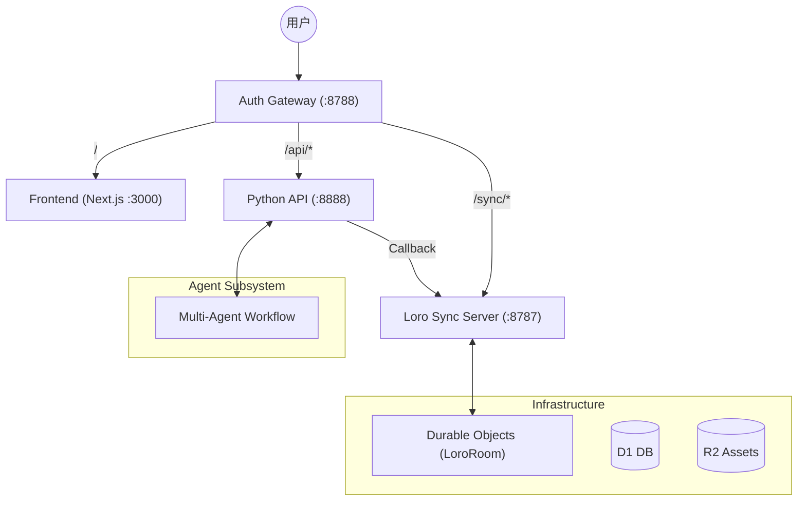

# Clash

> **Next-Gen Co-Creation Platform** —— 重新定义 AI 与人类在创意画布上的共生关系。

## 核心愿景: Creative Democratization (创作平权)

Clash 致力于进一步降低优质内容的创作门槛，不仅是简单的工具降权，更是创意的升维。

*   **Anti-Slop (反垃圾内容)**: 我们反对 AI 生成大量同质化的垃圾内容 (Slop)。我们的目标是利用 AI 赋能人类，去创作原本受限于技术或成本而无法实现的**高质量内容**。
*   **Co-Creators (人机共创)**: Human 和 Agent 是平等的合作伙伴。
    1.  **Idea First**: 在制作之前，AI 与你共同打磨创意，确保从源头就是高质量的。
    2.  **Comprehensive Realization**: 通过 AI 辅助剪辑、AIGC 生成、Motion Graphics 等手段，全方位落地你的想象。

## 核心特性

### 1. Idea Co-creation (创意共创)
不再是简单的 "Prompt -> Video"。Agent 会深度参与你的构思过程，提供灵感、挑战逻辑、完善脚本，确保每一个视频都有扎实的创意内核。

### 2. Sleep-time Production (异步制作)
这是我们实现 "Co-creation" 的重要机制。当你休息或专注于构思时，Agent 们正在后台进行繁重的执行工作：
*   深度思考与资产预生成
*   脚本优化与分镜设计
*   自动化的粗剪与时间轴编排

### 3. Skill-Based Agent System (基于技能的智能体系统)
我们将工业界的最佳实践（SOP）沉淀为可复用的 **Skills**。
*   **SOP as Skills**: 无论是短剧脚本结构还是分镜逻辑，都封装为 Skill。
*   **Dynamic Loading**: 用户可按需加载，Agent 也可根据意图自动调用。
*   **Sub-agents**: 专业的任务交给专业的子智能体（如 Coding Agent 负责 Motion Graph 代码生成）。

## 技术哲学: Minimalist & Evolvable

*   **Shared Context (Canvas)**: 画布即环境 (Environment)。Agent 的操作被简化为对画布状态的 **Read** 和 **Write**。
*   **Lightweight Core**: 保持 Agent 骨架的轻量化，通过扩展 **Skills** 来赋予其强大的能力。这种架构使得系统简洁且具备无限的演进潜力。

---

## 系统架构 (Technical Architecture)

系统采用 **Gateway Pattern**，通过统一入口分发流量，实现多端状态共享。



> 详细技术规格请参阅 [ARCHITECTURE.md](file:///Users/xiaoyang/Proj/clash/apps/loro-sync-server/ARCHITECTURE.md)。

---

## 快速开始

### 本地开发环境

```bash
# 启动所有组件 (Auth Gateway + Web + Sync + API)
make dev-gateway-full
```

| 服务 | 地址 |
|------|------|
| **主入口** | `http://localhost:8788` |
| 前端 | `http://localhost:3000` |
| 同步服务器 | `http://localhost:8787` |
| 专家系统 | `http://localhost:8888` |

---

*“让计算永不停歇，让创意自然流淌。”*
