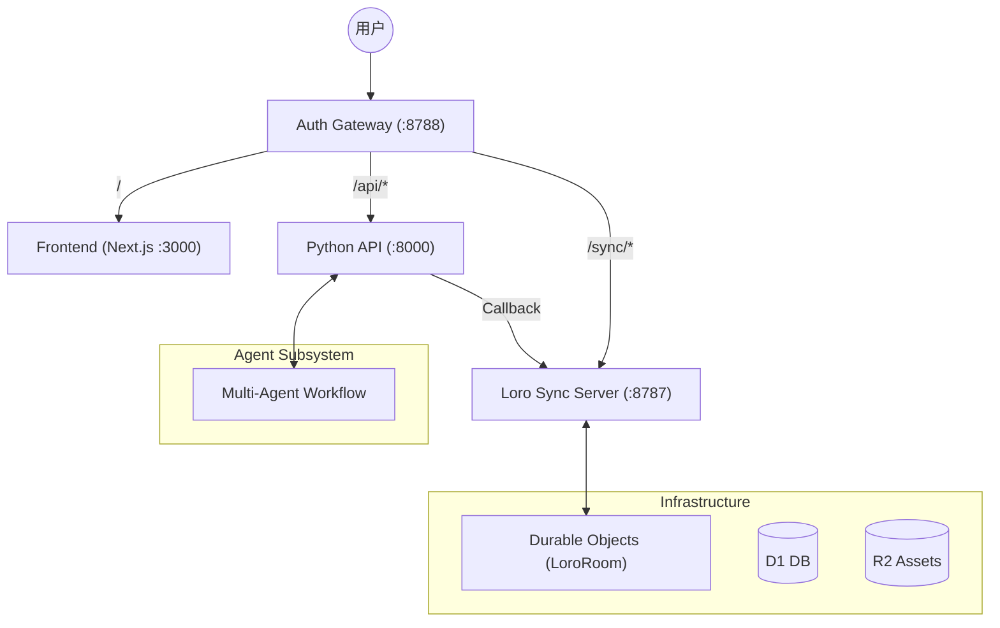

# Clash

> **视频原生的多智能体协作平台** —— 重新定义 AI 与人类在创意画布上的共生关系。

## 核心愿景: Sleep-time Compute (闲时计算)

Clash 的诞生源于一个朴素的愿景：**让 AI 在你睡觉时为你工作**。

在传统的创作流程中，计算往往是响应式的（你点一下，AI 动一下）。而在 Clash 中，后台的多智能体系统会自动感知你的画布状态。当你休息或构思时，Agent 们正在进行深度思考、资产预生成和脚本优化。当你再次回到画布前，迎接你的是更成熟的草案和已经生成好的视觉资产。

## 设计哲学: 自主与控制 (Autonomy + Control)

我们不追求黑盒式的自动化，而是追求“高自主性”与“高可控性”的完美平衡：

*   **给予 Agent 更多上下文 (More Context)**: Agent 通过 Loro 画布（Shared Brain）获取全局视野。它们能读懂你的布局逻辑、视觉风格和参考图关系，从而做出更聪明的自主决策。
*   **给予人类更多控制权 (More Control)**: 
    *   **SSE 提案机制**: AI 的动作（如新建节点）首先以“提案”形式展现，你可以观察 AI 实时思考的过程并随时干预。
    *   **双向实时编辑**: 基于 Loro CRDT 技术，人类可以随时“接管” AI 正在编写的代码或脚本，实现真正的实时同屏协作。

---

## 核心特性

### 1. 协作画布 (Shared Loro Canvas)
采用 [Loro](https://loro.dev) 作为底层状态引擎，支持离线编辑、冲突合并和毫秒级的实时同步。画布不仅是你的编辑区，也是 AI 的“共同操作图”。

### 2. 多智能体专家系统 (Multi-Agent)
基于 LangGraph 构建的专家集群：
- **Supervisor**: 任务调度，拆解指令。
- **ScriptWriter**: 文字内容底座。
- **ConceptArtist**: 视觉概念化。
- **StoryboardDesigner**: 分镜节奏规划。
- **Editor**: 时间轴自动化。

### 3. Action 触发 Asset 逻辑
画布采用“意图与资产分离”的设计。`ActionBadge` 承载人类的提示词和参数，触发产生 `Image/Video` 资产节点。通过 `NodeProcessor` 的自动观测，实现异步任务的闭环。

---

## 系统架构 (Technical Architecture)

系统采用 **Gateway Pattern**，通过统一入口分发流量，实现多端状态共享。



> 详细技术规格请参阅 [ARCHITECTURE.md](file:///Users/xiaoyang/Proj/clash/apps/loro-sync-server/ARCHITECTURE.md)。

---

## 快速开始

### 本地开发环境

```bash
# 启动所有组件 (Auth Gateway + Web + Sync + API)
make dev-gateway-full
```

| 服务 | 地址 |
|------|------|
| **主入口** | `http://localhost:8788` |
| 前端 | `http://localhost:3000` |
| 同步服务器 | `http://localhost:8787` |
| 专家系统 | `http://localhost:8000` |

---

*“让计算永不停歇，让创意自然流淌。”*
