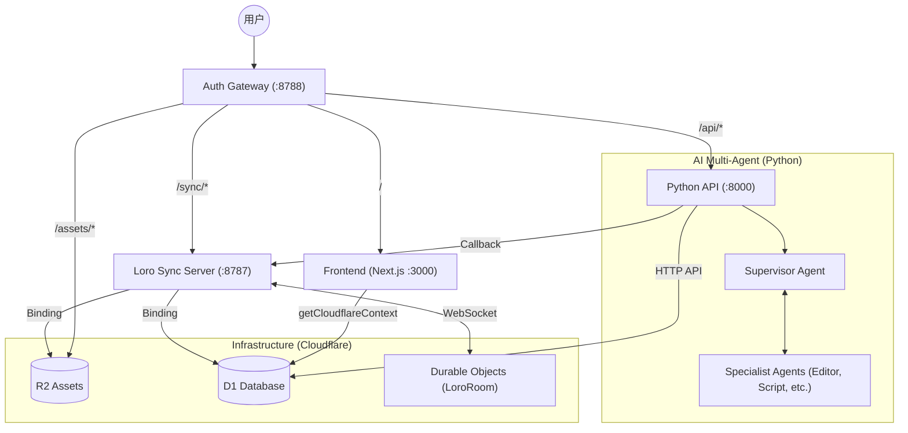
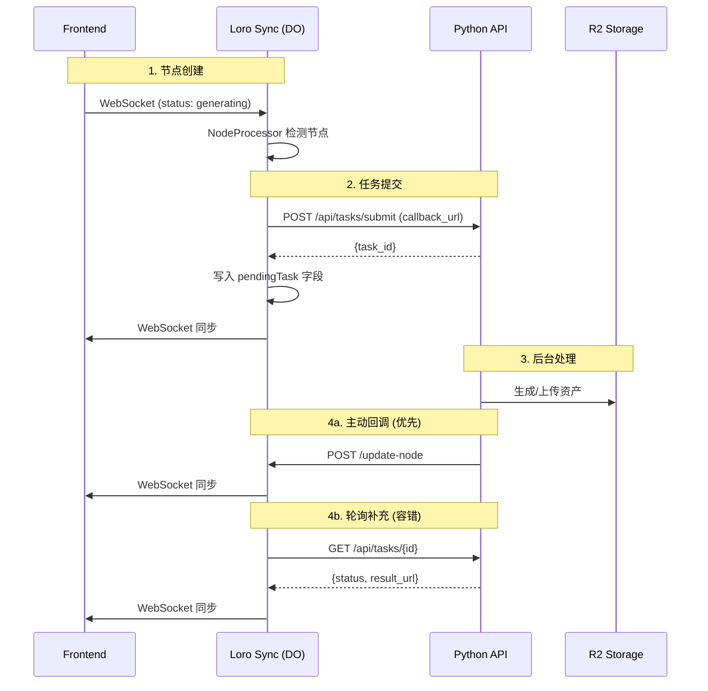

# Clash 架构文档

> 基于 Cloudflare Workers + Python API 的多智能体视频协作平台

## 系统全景图 (Gateway Pattern)

所有流量通过 `auth-gateway` 统一分发，共享 D1 数据库和 R2 存储。



## 任务系统 (回调 + 轮询)

**双机制设计**: Python 主动回调 + Loro 定时轮询兜底



## 核心组件

| 组件 | 职责 |
|------|------|
| **NodeProcessor** | 检测 `generating` 节点，提交到 Python API |
| **TaskPolling** | 轮询有 `pendingTask` 的节点状态 |
| **Python API** | 任务执行、R2 上传、回调通知 |
| **LoroRoom** | DO 编排器，WebSocket 同步 |

## 状态流转

```
generating (无 src, 无 pendingTask)
         ↓ NodeProcessor 提交任务
generating (有 pendingTask)
         ↓ Python 完成 + 回调
completed (有 src, 无 description)
         ↓ NodeProcessor 提交 describe
completed (有 pendingTask)
         ↓ Python 完成 + 回调
fin (有 description)
```

## Loro 状态设计 (CRDT)

系统使用 [Loro](https://loro.dev) 作为底层的 CRDT 引擎。状态存储在 `LoroRoom` (Durable Object) 中。

### 核心 Map 结构
- `nodes`: 存储所有画布节点。包含 `position`, `type`, `data` (src, status, prompt, params 等)。
- `edges`: 存储节点间的连接关系。
- `tasks`: 存储后台任务的执行状态，作为前端与 Python API 异步协作的中转站。

### 协作机制
- **增量更新**: 前端只发送 Loro 的 `update` 字节流，DO 接收并 `import`。
- **冲突合并**: Loro 自动处理多人编辑冲突，通过 `export('update')` 与其他客户端同步。
- **快照持久化**: DO 定期将完整快照保存到 D1 数据库。

## 前端画布逻辑 (Action + Asset)

画布采用了 **"Action 触发 Asset"** 的设计哲学：

- **Action (ActionBadge)**: 负责用户输入。用户在 `PromptActionNode` 中输入提示词、调整参数、连接参考图。点击执行后，它不直接生成结果，而是创建一个 "Asset" 节点。
- **Asset (ImageNode/VideoNode)**: 负责结果展示。初始状态为 `generating`。它是一个状态占位符，由 `loro-sync-server` 的 `NodeProcessor` 观测到并提交给后端。结果产生后，资产节点会自动更新 `src` 展现内容。

> [!TIP]
> 这种分离允许用户在等待生成的同时继续调整 Action 节点的参数，或创建新的 Action。

## Agent 工作流 (Multi-Agent)

Python API 侧实现了一套基于 LangGraph 的多智能体系统。其核心设计理念是 **"Canvas as Context" (画布即上下文)**。

### 画布即上下文 (Shared Brain)

不同于传统的对话式 AI，这里的 Agent 不仅仅依赖短期记忆，而是将 Loro 画布视为 **"共同操作图" (Common Operating Picture)**：
- **可观测性**: Agent 通过 API 实时读取画布上的节点（脚本、提示词、参考图），获取项目的全局视野。
- **可操作性**: Agent 对画布的每一次修改（创建节点、更新内容）都会直接通过 `loro-sync-server` 同步给人类用户。
- **协作媒介**: 专家 Agent 之间不需要复杂的内部通信，它们通过在画布上“留言”或创建下游任务节点来实现串联。

### 核心工具集 (Canvas Tools)

Agent 通过 `CanvasMiddleware` 获得了一系列操作画布的工具：

| 工具分类 | 工具名称 | 功能描述 |
|------|------|------|
| **感知 (Observation)** | `list_canvas_nodes` | 扫描画布，获取所有节点的元数据 |
| | `read_canvas_node` | 读取特定节点的详细内容（如脚本原文） |
| | `search_canvas` | 根据关键词在所有节点中搜索相关信息 |
| **执行 (Action)** | `create_generation_node` | 创建 `PromptActionNode`，合并 Prompt 与生成配置 |
| | `run_generation_node` | 触发该节点的 AIGC 生成流水线 |
| **同步 (Coordination)** | `wait_for_generation` | 轮询等待生成任务完成（获取 Asset ID/URL） |
| | `create_canvas_node` | 创建纯文本或 Group 节点（用于组织项目结构） |

### 专家系统角色

- **Supervisor**: 调度中心。解析人类指令，拆解任务并分发给专家。
- **ScriptWriter**: 负责内容底座。在画布上创建 Story Outline / Script 的文本节点。
- **ConceptArtist**: 将文字视觉化。读取脚本，创建 `image_gen` 类型节点，并配置视觉提示词。
- **StoryboardDesigner**: 规划节奏。创建 `video_gen` 节点，并根据脚本和 Concept 结果建立节点连接（Upstream IDs）。
- **Editor**: 最终整合。利用 `timeline_editor` 工具，将画布上的资产按照逻辑排列到时间轴。

### 技术实现

1. **StateCanvasBackend**: Python 端的后端实现，负责将 Tool Call 转换为对 Loro 状态的查询。
2. **SSE Proposals**: Agent 进行“写”操作时，会通过 SSE (Server-Sent Events) 向前端发送提案，实现界面的低延迟实时预览（AI Thinking -> Proposed Node）。
3. **Loro-to-API**: 后端的 `context.py` 定期同步 Loro Snapshot，确保 Agent 拥有最新的“现场感”。

### 自主性与控制的平衡 (Autonomy + Control)

Clash 的 Agent 架构追求 **“高自主性，高可控性”**：

- **给予 Agent 更多上下文 (More Context)**:
  - Agent 不仅读取当前的提示词，还能感知画布上的节点布局、参考图关系、历史指令。这使得 Agent 的自主决策（如自动规划分镜）是基于对项目深度理解的基础之上的。
- **给予人类更多控制权 (More Control)**:
  - **SSE 提案机制**: Agent 的每一步写操作（如新建节点）都先以“提案”形式展现给用户。用户可以随时观察 AI 的“思绪”（Thinking Block），并在 AI 动作前进行干预。
  - **双向编辑**: Loro 的 CRDT 特性确保 AI 和人类可以同时编辑同一个节点。人类可以随时“接管” AI 正在编写的脚本，或直接修改 AI 刚刚生成的布局。
  - **工具细粒度**: 通过 `run_generation_node`，Agent 具备触发生成的自主权，但生成的最终参数始终暴露在 `ActionBadge` 的 UI 中，方便人类微调。

## 目录结构

```
apps/loro-sync-server/src/
├── LoroRoom.ts          # 主 Durable Object (编排器)
├── processors/
│   └── NodeProcessor.ts # 扫描节点，提交任务
├── polling/
│   └── TaskPolling.ts   # 轮询 pendingTask 节点
├── sync/
│   └── NodeUpdater.ts   # 更新节点到 Loro CRDT
└── types.ts             # 环境变量类型
```

## 环境变量

| 变量 | 说明 |
|------|------|
| `BACKEND_API_URL` | Python API URL |
| `LORO_SYNC_URL` | Loro Sync 公网 URL (回调用) |
| `KLING_ACCESS_KEY` | Kling AI 密钥 |
| `GEMINI_API_KEY` | Gemini API 密钥 |

## 本地开发

```bash
# 统一启动
make dev-gateway-full
```

| 服务 | 本地地址 |
|------|----------|
| **统一入口** | `http://localhost:8788` |
| 前端 | `http://localhost:3000` |
| Loro Sync | `http://localhost:8787` |
| Python API | `http://localhost:8000` |

---

## 初衷与愿景: Sleep-time Compute

Master Clash 的核心初衷是实现 **Sleep-time Compute** (闲时计算)。

当创作者在构思或休息（闲时）时，后台的 Multi-Agent 系统会根据当前的画布状态和历史上下文，自动进行深度思考、资产预生成、脚本优化等高能耗任务。当用户回到画布前，迎接他们的是更丰富的草案和半成品。

*“让 AI 在你睡觉时为你工作，让计算永不停歇。”*
