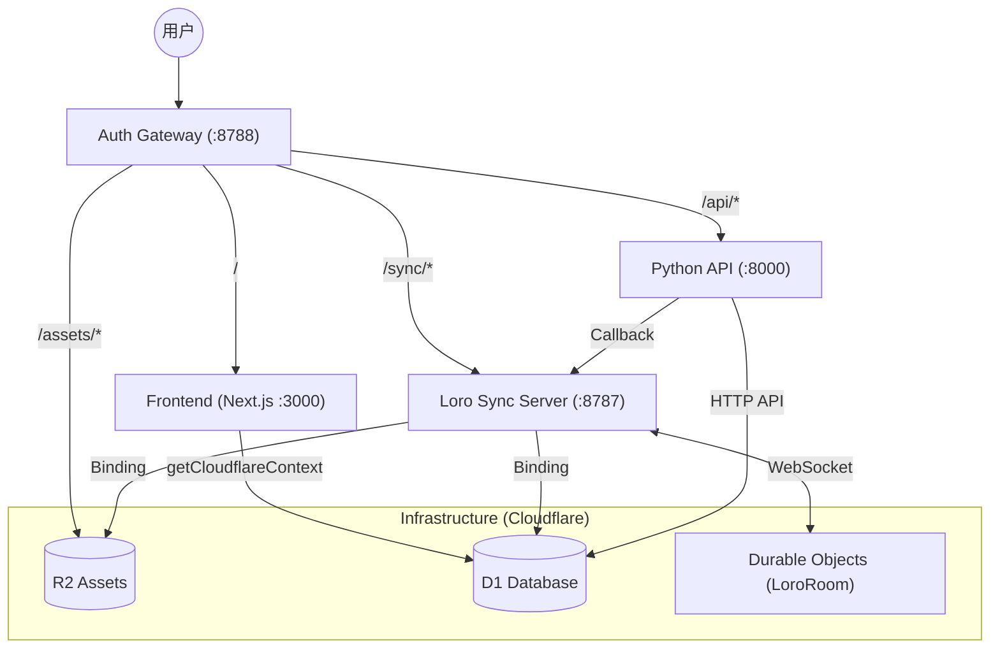
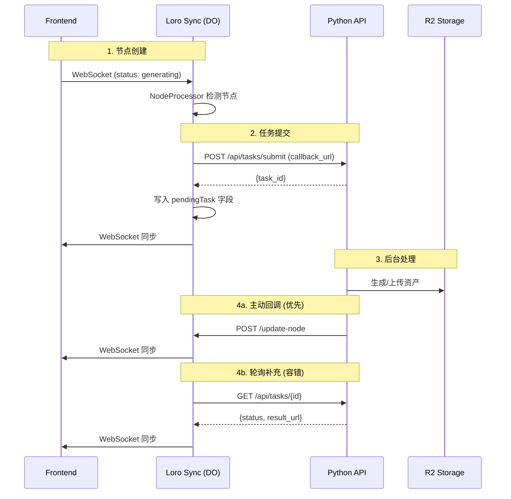

# Master Clash 架构文档

> 基于 Cloudflare Workers + Python API 的多智能体视频协作平台

## 系统全景图 (Gateway Pattern)

所有流量通过 `auth-gateway` 统一分发，共享 D1 数据库和 R2 存储。



## 任务系统 (回调 + 轮询)

**双机制设计**: Python 主动回调 + Loro 定时轮询兜底



## 核心组件

| 组件 | 职责 |
|------|------|
| **NodeProcessor** | 检测 `generating` 节点，提交到 Python API |
| **TaskPolling** | 轮询有 `pendingTask` 的节点状态 |
| **Python API** | 任务执行、R2 上传、回调通知 |
| **LoroRoom** | DO 编排器，WebSocket 同步 |

## 状态流转

```
generating (无 src, 无 pendingTask)
         ↓ NodeProcessor 提交任务
generating (有 pendingTask)
         ↓ Python 完成 + 回调
completed (有 src, 无 description)
         ↓ NodeProcessor 提交 describe
completed (有 pendingTask)
         ↓ Python 完成 + 回调
fin (有 description)
```

## 目录结构

```
apps/loro-sync-server/src/
├── LoroRoom.ts          # 主 Durable Object (编排器)
├── processors/
│   └── NodeProcessor.ts # 扫描节点，提交任务
├── polling/
│   └── TaskPolling.ts   # 轮询 pendingTask 节点
├── sync/
│   └── NodeUpdater.ts   # 更新节点到 Loro CRDT
└── types.ts             # 环境变量类型
```

## 环境变量

| 变量 | 说明 |
|------|------|
| `BACKEND_API_URL` | Python API URL |
| `LORO_SYNC_URL` | Loro Sync 公网 URL (回调用) |
| `KLING_ACCESS_KEY` | Kling AI 密钥 |
| `GEMINI_API_KEY` | Gemini API 密钥 |

## 本地开发

```bash
# 统一启动
make dev-gateway-full
```

| 服务 | 本地地址 |
|------|----------|
| **统一入口** | `http://localhost:8788` |
| 前端 | `http://localhost:3000` |
| Loro Sync | `http://localhost:8787` |
| Python API | `http://localhost:8000` |
