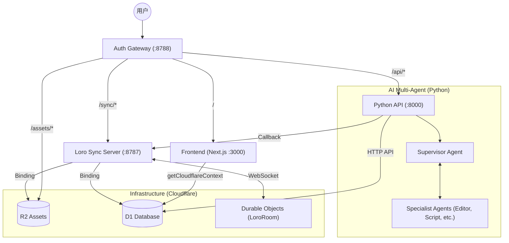
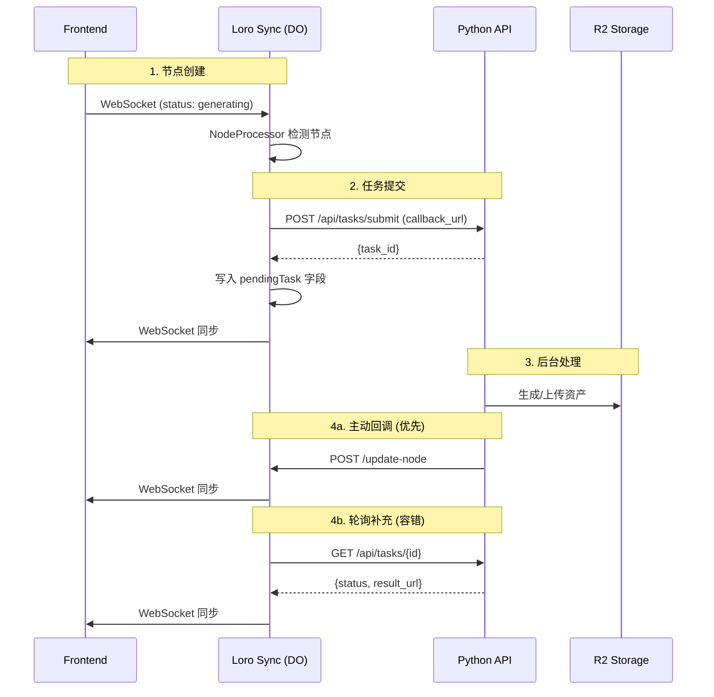

# Master Clash 架构文档

> 基于 Cloudflare Workers + Python API 的多智能体视频协作平台

## 系统全景图 (Gateway Pattern)

所有流量通过 `auth-gateway` 统一分发，共享 D1 数据库和 R2 存储。



## 任务系统 (回调 + 轮询)

**双机制设计**: Python 主动回调 + Loro 定时轮询兜底



## 核心组件

| 组件 | 职责 |
|------|------|
| **NodeProcessor** | 检测 `generating` 节点，提交到 Python API |
| **TaskPolling** | 轮询有 `pendingTask` 的节点状态 |
| **Python API** | 任务执行、R2 上传、回调通知 |
| **LoroRoom** | DO 编排器，WebSocket 同步 |

## 状态流转

```
generating (无 src, 无 pendingTask)
         ↓ NodeProcessor 提交任务
generating (有 pendingTask)
         ↓ Python 完成 + 回调
completed (有 src, 无 description)
         ↓ NodeProcessor 提交 describe
completed (有 pendingTask)
         ↓ Python 完成 + 回调
fin (有 description)
```

## Loro 状态设计 (CRDT)

系统使用 [Loro](https://loro.dev) 作为底层的 CRDT 引擎。状态存储在 `LoroRoom` (Durable Object) 中。

### 核心 Map 结构
- `nodes`: 存储所有画布节点。包含 `position`, `type`, `data` (src, status, prompt, params 等)。
- `edges`: 存储节点间的连接关系。
- `tasks`: 存储后台任务的执行状态，作为前端与 Python API 异步协作的中转站。

### 协作机制
- **增量更新**: 前端只发送 Loro 的 `update` 字节流，DO 接收并 `import`。
- **冲突合并**: Loro 自动处理多人编辑冲突，通过 `export('update')` 与其他客户端同步。
- **快照持久化**: DO 定期将完整快照保存到 D1 数据库。

## 前端画布逻辑 (Action + Asset)

画布采用了 **"Action 触发 Asset"** 的设计哲学：

- **Action (ActionBadge)**: 负责用户输入。用户在 `PromptActionNode` 中输入提示词、调整参数、连接参考图。点击执行后，它不直接生成结果，而是创建一个 "Asset" 节点。
- **Asset (ImageNode/VideoNode)**: 负责结果展示。初始状态为 `generating`。它是一个状态占位符，由 `loro-sync-server` 的 `NodeProcessor` 观测到并提交给后端。结果产生后，资产节点会自动更新 `src` 展现内容。

> [!TIP]
> 这种分离允许用户在等待生成的同时继续调整 Action 节点的参数，或创建新的 Action。

## Agent 工作流 (Multi-Agent)

Python API 侧实现了一套基于 LangGraph 的多智能体系统：

- **Supervisor**: 任务调度中心。根据用户需求决定调用哪个专家 Agent。
- **ScriptWriter**: 编写脚本与旁白。
- **ConceptArtist**: 设计视觉风格。
- **StoryboardDesigner**: 规划分镜。
- **Editor**: 后期剪辑与合成。

Agent 通过 `CanvasMiddleware` 直接操作 Loro 状态（通过 Callback API），实现 AI 与人的无缝协作。

## 目录结构

```
apps/loro-sync-server/src/
├── LoroRoom.ts          # 主 Durable Object (编排器)
├── processors/
│   └── NodeProcessor.ts # 扫描节点，提交任务
├── polling/
│   └── TaskPolling.ts   # 轮询 pendingTask 节点
├── sync/
│   └── NodeUpdater.ts   # 更新节点到 Loro CRDT
└── types.ts             # 环境变量类型
```

## 环境变量

| 变量 | 说明 |
|------|------|
| `BACKEND_API_URL` | Python API URL |
| `LORO_SYNC_URL` | Loro Sync 公网 URL (回调用) |
| `KLING_ACCESS_KEY` | Kling AI 密钥 |
| `GEMINI_API_KEY` | Gemini API 密钥 |

## 本地开发

```bash
# 统一启动
make dev-gateway-full
```

| 服务 | 本地地址 |
|------|----------|
| **统一入口** | `http://localhost:8788` |
| 前端 | `http://localhost:3000` |
| Loro Sync | `http://localhost:8787` |
| Python API | `http://localhost:8000` |

---

## 初衷与愿景: Sleep-time Compute

Master Clash 的核心初衷是实现 **Sleep-time Compute** (闲时计算)。

当创作者在构思或休息（闲时）时，后台的 Multi-Agent 系统会根据当前的画布状态和历史上下文，自动进行深度思考、资产预生成、脚本优化等高能耗任务。当用户回到画布前，迎接他们的是更丰富的草案和半成品。

*“让 AI 在你睡觉时为你工作，让计算永不停歇。”*
