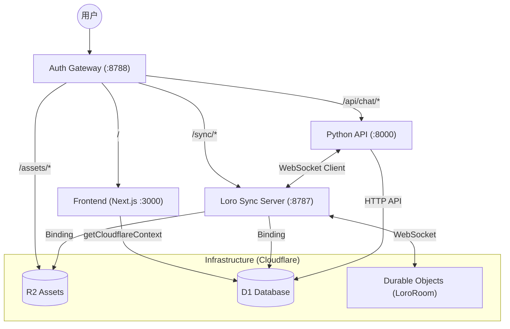
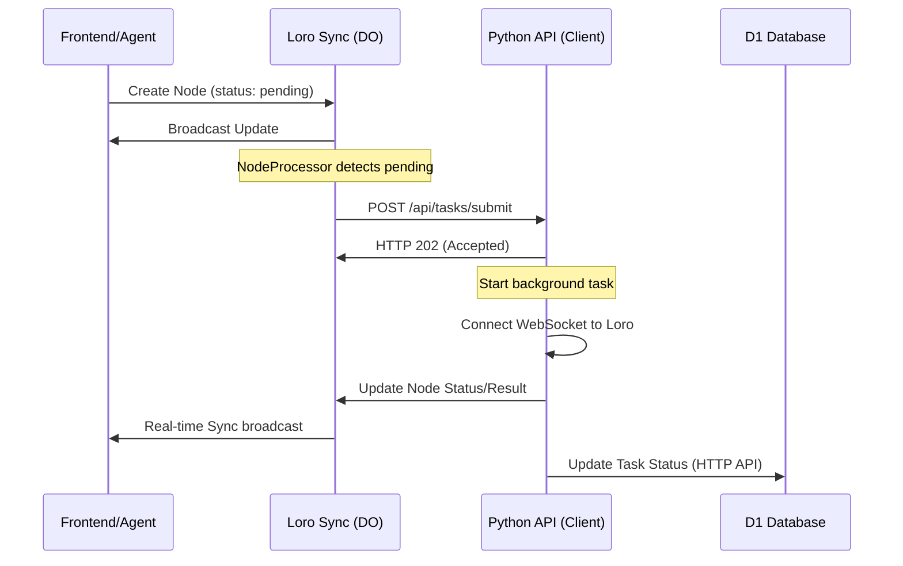

# Master Clash 架构文档

> 基于 Cloudflare Workers + Durable Objects + Python API 的多智能体视频协作平台

## 系统全景图 (Gateway Pattern)

所有流量通过 `auth-gateway` 统一分发，共享 D1 数据库和 R2 存储。



## 核心组件

```
┌─────────────────────────────────────────────────────────────────┐
│                         LoroRoom (Durable Object)               │
│  每个 project 对应一个 LoroRoom 实例，管理该项目的所有状态        │
├─────────────────────────────────────────────────────────────────┤
│  Loro CRDT Document                                              │
│  ├─ nodes: Map<nodeId, NodeData>   ← Canvas 节点               │
│  ├─ edges: Map<edgeId, EdgeData>   ← 连接线                    │
│  └─ tasks: Map<taskId, TaskData>   ← AIGC 任务状态              │
└─────────────────────────────────────────────────────────────────┘
```

## 任务系统架构

Loro Sync 作为**任务编排器**，将 AIGC 任务委托给不同的 Provider：

```
┌─────────────────────────────────────────────────────────────────┐
│                    Loro Sync (编排器)                            │
│                                                                   │
│  • 检测 pending 节点                                              │
│  • 分发任务到 Provider                                            │
│  • alarm 轮询任务状态                                             │
│  • 更新节点结果                                                   │
└──────────────────┬───────────────────┬────────────────────────────┘
                   │                   │
         ┌─────────▼─────────┐  ┌──────▼──────┐
         │   Python API      │  │  Kling AI   │
         │   (Provider)      │  │  (Provider) │
         ├───────────────────┤  ├─────────────┤
         │ • image_gen       │  │ • video_gen │
         │ • image_desc      │  │             │
         │ • video_desc      │  │             │
         └───────────────────┘  └─────────────┘
```

### Provider 统一接口

| 端点 | 说明 |
|------|------|
| `POST /api/tasks/submit` | 提交任务 |
| `GET /api/tasks/{task_id}` | 查询状态 |

### 心跳/租约机制

防止孤儿任务：
- **租约**: 3 分钟
- **心跳**: 30 秒
- **过期**: 直接标记失败

## 目录结构

```
apps/loro-sync-server/src/
├── LoroRoom.ts          # 主 Durable Object
│
├── clients/             # 🔌 外部 API 客户端
│   └── TaskClient.ts        # Python API 任务客户端
│
├── generators/          # 🎨 AIGC 执行器
│   └── VideoGeneration.ts   # Kling 视频生成 (异步轮询)
│
├── processors/          # 🔍 节点处理器
│   └── NodeProcessor.ts     # 扫描 pending 节点，分发任务
│
├── polling/             # ⏱️ 任务轮询
│   └── TaskPolling.ts       # 检查异步任务完成状态
│
├── sync/                # 📡 CRDT 同步
│   └── NodeUpdater.ts       # 更新节点数据到 Loro
│
├── routes/              # 🌐 HTTP 路由
│   ├── assets.ts            # /upload, /assets/* (R2)
│   └── webhooks.ts          # 外部回调
│
├── storage.ts           # R2 存储操作
└── types.ts             # 类型定义
```

### 1. 任务处理流程 (Canvas -> Sync -> Python)



### 2. 视频生成 (Kling Provider - 异步)

```
Loro Sync                   Kling API
     │                          │
     │── submit ───────────────▶│
     │   { prompt, image }      │
     │                          │
     │◀── { task_id } ──────────│
     │                          │
     │   (alarm: 5s)            │
     │                          │
     │── poll ─────────────────▶│
     │                          │
     │◀── { status: pending } ──│
     │                          │
     │   (alarm: retry)         │
     │   ...                    │
     │                          │
     │── poll ─────────────────▶│
     │                          │
     │◀── { status: completed } │
     │                          │
     │── update node            │
```

## 环境变量

| 变量 | 说明 |
|------|------|
| `BACKEND_API_URL` | Python API URL (默认: `http://localhost:8000`) |
| `KLING_ACCESS_KEY` | Kling AI 访问密钥 |
| `KLING_SECRET_KEY` | Kling AI 密钥 |
| `WORKER_PUBLIC_URL` | Worker 公网 URL |

## 本地开发

推荐通过 `Makefile` 启动全量服务：

```bash
# 在项目根目录
make dev-gateway-full
```

| 服务 | 本地地址 | 备注 |
|------|----------|------|
| **统一入口** | `http://localhost:8788` | **Auth Gateway (Wrangler)** |
| 前端 (Next.js) | `http://localhost:3000` | 通常由 Gateway 反向代理 |
| 同步服务器 (TS) | `http://localhost:8787` | 提供 WebSocket `/sync/:id` |
| 业务后端 (Python) | `http://localhost:8000` | 任务执行 & 智能编排 |
